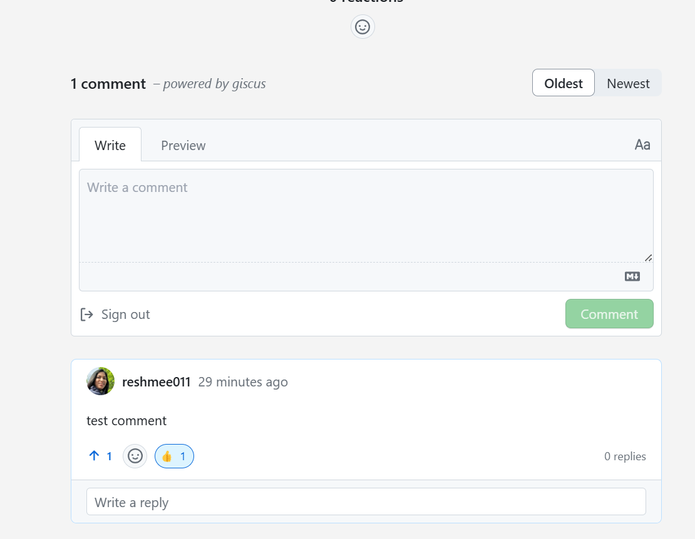

# Enable Giscus for Hugo Blog

I recently switched to Giscus for comments on my blog post, inspired by its popularity among other bloggers. Giscus, a commenting system powered by GitHub Discussions, offers a seamless way to engage with readers. If you're using Hugo for your blog hosted on GitHub, linking Giscus to your posts is straightforward. 


The following setup guide is based on instructions generated by GitHub Copilot, which I successfully followed to integrate Giscus into my blog.



The following setup guide is based on instructions generated by GitHub Copilot, which I successfully followed to integrate Giscus into my blog.


**Note**: The following setup guide is based on instructions generated by GitHub Copilot, which I successfully followed to integrate Giscus into my blog.

1. Navigate to the [Giscus App](https://giscus.app) and authenticate using your GitHub account.
   

2. Choose the repository you wish to use for storing comments.
   

3. Adjust the settings according to your preferences (e.g., discussion category, reaction options).
   

4. Copy the script generated by Giscus.
   

## Integrate Giscus Script into Your Hugo Site

5. Create a `giscus.html` file within `layouts/partials` and insert the script you copied earlier. The script should look like this:

```html
<!-- layouts/partials/giscus.html -->
<script src="https://giscus.app/client.js"
    data-repo="username/repo"
    data-repo-id="repo-id"
    data-category="Announcements"
    data-category-id="category-id"
    data-mapping="pathname"
    data-reactions-enabled="1"
    data-emit-metadata="0"
    data-input-position="top"
    data-theme="preferred_color_scheme"
    data-lang="en"
    crossorigin="anonymous"
    async>
</script>
```

6. I am using the ananke theme for Hugo. Copy the theme's layout by copying the file **single.html** file from themes/ananke/layouts/_default/ to the site's layouts directory at layouts/_default/single.html if there is not one already.


7. Modify this copied file in the same way by adding the {{ partial "giscus.html" . }} line where the comments need to appear.


In my scenerio I replaced the existing placeholder for commento **{{- partial "commento.html" . -}}** with **{{ partial "giscus.html" . }}**

8. Test the integration:

Ensure after the hugo site is published with netlify, the posts have Giscus appearing and login to Github to leave a comment to test.



## Conclusion

By following the above steps, Giscus comments can be integrated into Hugo blog posts, enhancing engagement and interaction with blog readers.
